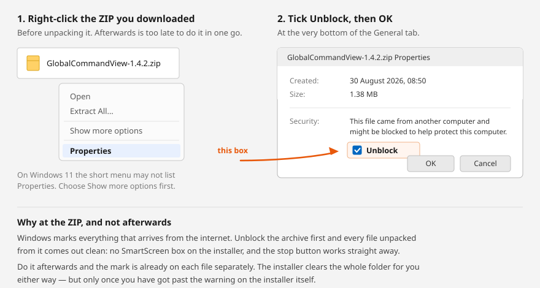

# Global Command View

A live picture of the world built only from public feeds, on a 3D globe that runs
on your own machine. Aircraft, ships, satellites, radar that sees through cloud,
submarine cables, public road cameras, radio you can listen to, traffic, rocket
launches. Thirty-seven layers.

**Every layer says where its data came from and how sure it is.** Nothing is
simulated, nothing is smoothed, and when a feed has nothing to say the app says
that rather than drawing an empty map.

**It opens empty.** No layer is on until you switch one on, so the first thing
you turn on is the first thing you see. A welcome page says what to try first;
tick the box and it stays gone, and **WELCOME** in the top bar brings it back.

## Watch it first

<table>
<tr>
<td width="50%" valign="top">
<a href="https://youtu.be/DI1-QUQtPtI"></a>
<p><b><a href="https://youtu.be/DI1-QUQtPtI">Modern Onboarding</a></b> &middot; 18 min<br>
Downloading it, installing it, and what the layers actually show. Start here if
you have never run it.</p>
</td>
<td width="50%" valign="top">
<a href="https://youtu.be/YqUMbXMA2MI"></a>
<p><b><a href="https://youtu.be/YqUMbXMA2MI">Orlando: ATC and approach</a></b> &middot; 7 min<br>
Following live traffic into an airfield with the frequencies, the runway
geometry and the approach lines on screen.</p>
</td>
</tr>
</table>


*Twelve thousand six hundred aircraft, twenty-four thousand ships, 4 143 public
cameras, 724 submarine cables. Detection mode is naming contacts — SAT-69021
HELIOS, MIL-PAT100, a Starlink shell drawn from live orbital elements. Every
number in the panel is what that feed actually returned.*


*The panorama is embedded and walkable — the arrows walk and the globe follows.
Beside it, a public road camera twelve kilometres away with PROJECT ONTO GROUND
ready to paint its live frame onto the map. In the panel, the meters: 27 of
1 000 free 3D sessions and 366 of 10 000 Street View views used this month.*

---

## Getting it running

**Windows, and you have never installed anything like this:** download the ZIP,
right-click it, choose **Extract All**, then double-click
**`Install Global Command View.cmd`** inside. It checks for Python, offers to
install it if it is missing, and then starts the app. If Python is already there
it says so and goes straight to starting.

**No administrator rights are needed.** Everything it installs goes to your own
user account — winget with `--scope user`, or the python.org installer with
`InstallAllUsers=0`. Nothing outside your user folder is touched and nobody else
on the computer is affected. **If Windows asks you to elevate while running it,
something is wrong: say no.**

It asks before downloading anything and says what it will fetch and from where
(python.org, about 26 MB). An installer that pulls an executable without telling
you is indistinguishable from something you would not want, so this one tells
you, and answering anything but `y` installs nothing.

### First, before you unpack it



Right-click the downloaded ZIP, choose **Properties**, tick **Unblock** at the
bottom, and press OK. *Then* extract it.

Windows marks everything that arrives from the internet, and that mark is what
raises the *Windows protected your PC* box on the launchers and stops
`stop.ps1` running at all. Clear it on the archive and every file unpacked from
it comes out clean, so you never meet the warning at all.

Skip this and nothing is lost &mdash; the installer clears the whole folder for you.
But you have to get past the warning on the installer itself first, and doing it
at the ZIP is one tick instead.

Once Python is on the machine, **`Start Global Command View.cmd`** is the one to
use from then on.

> **Windows will probably stop you the first time.** A `.cmd` file that came from
> the internet triggers SmartScreen: a blue box saying *Windows protected your
> PC*, with only a **Don't run** button visible. The way through is **More
> info** → **Run anyway**. That warning is Windows telling you it has never seen
> this file before, which is true and will be true of anything you download from
> a small project. If you would rather not take my word for it, the file is
> fifty lines of batch script and forty of them are the message it prints when
> Python is missing — open it in Notepad first and read it. That is the honest
> answer to a security prompt: look at the thing.
>
> Alternatively, skip the launcher entirely and run `python server.py` in that
> folder. It does the same job with nothing to click past.
>
> **It only happens once.** Everything unpacked from a downloaded ZIP carries a
> hidden tag called the Mark of the Web, which is what raises that box — and
> what stops `stop.ps1` running at all. The installer takes the tag off the
> whole folder before it does anything else, using Windows' own `Unblock-File`.
> After that the launchers open without a word. **`Trust these files.ps1`** does
> the same on its own if you already installed and want the warnings gone; it
> works only on the folder it sits in and refuses to run unless `server.py` is
> beside it, so it cannot be pointed at a directory of things nobody looked at.

**macOS:** download the ZIP, unpack it, then **right-click**
**`Start Global Command View.command`** and choose **Open** &mdash; then **Open**
again in the box that appears. Not double-click, the first time.

> **You are not doing anything wrong when macOS refuses.** It will say the file
> *cannot be opened because it is from an unidentified developer*, or *Apple
> could not verify it is free of malware*. That is Gatekeeper, and it says the
> same about everything downloaded from outside the App Store that has not been
> signed with a $99-a-year Apple Developer certificate. Right-click &rarr; Open is
> the deliberate gesture that says you meant it, and you only do it once.
>
> On macOS 15 Sequoia and later, right-click &rarr; Open may not offer a way
> through. Then: **System Settings &rarr; Privacy &amp; Security**, scroll down, and
> press **Open Anyway** next to the file's name. Same thing, moved.
>
> **You do not need Wine, Whisky, CrossOver or any of that.** Those exist to run
> Windows `.exe` files on a Mac. There is no `.exe` here &mdash; this is Python and
> a browser, and both run on macOS natively. The `.cmd` files in the folder are
> the Windows launchers and can be ignored.
>
> If double-clicking does nothing at all and no message appears, that is the
> other thing: the executable bit. `chmod +x "Start Global Command View.command"`
> in Terminal, once. The ZIP does carry the bit, so this is rare.

The same file runs on Linux, where none of the above applies.

All of that is also in **`Mac users - read this first.txt`** inside the
folder, because somebody meeting *unidentified developer* for the first time
is looking at the folder, not at this page.

**Anything else, or if you would rather type it:** `python3 server.py`, then
open <http://localhost:8820>. Ctrl+C stops it.

`--port 8821` moves it if something already holds the port; `--no-open` skips the
browser.

**The server runs with no window.** The launcher shows one only while it starts,
says so, and closes itself once the server answers — so there is no black box on
the taskbar for as long as the app is up, and no window to close. Use
**`Stop Global Command View.cmd`** to shut it down. What the server would have
printed goes to `server.log` beside it, and if it fails to come up the launcher
stays open and puts the reason on screen instead of vanishing.

## Upgrading without losing your keys

**Unpack the new version straight over the old folder.** Nothing you made is in
the download, so there is nothing for it to overwrite: `keys.json`, your saved
views in `data/marks.json`, the Google spend tally and the disk cache are all
kept out of the archive on purpose. Verified by doing it &mdash; keys, marks and
cache came through untouched while `server.py` was replaced.

The risk runs the other way. **Unpacking somewhere new leaves your keys behind**
in the old folder, and the fresh copy starts with none. If you do that, copy
`keys.json` and the `data` folder across afterwards.

Nothing needs uninstalling first, and the installer can be run again safely: it
finds Python already there and simply starts.

There is **no configuration step, no account, and nothing to install beyond
Python.** No `pip install`, no npm, no build. The globe engine loads from a CDN,
so the first run needs internet.

The server itself is plain cross-platform Python — only the launchers differ.
The `.cmd` files and `stop.ps1` are for Windows, the `.command` file is for
macOS and Linux, and `python3 server.py` works everywhere without either.

### If you do not have Python

You need **Python 3.9 or newer**. It is free, from
<https://www.python.org/downloads/>, and takes about two minutes.

> **On the first screen of the Windows installer there is a checkbox at the bottom
> reading "Add python.exe to PATH". Tick it.** It is off by default and nothing
> here works without it — Windows will not be able to find Python even though it
> is installed. If you miss it, run the installer again and choose **Modify**.

On macOS and most Linux distributions Python is already there. Check with
`python3 --version`.

You do not need to know any Python. Nothing here is edited or compiled; the file
is run, the same way an application is.

### What you get with no keys at all

Measured on a run with the key file removed entirely:

| | Without any key | With the optional keys |
| --- | --- | --- |
| Aircraft | **8 163** | 12 754 |
| Ships | 711 (Baltic) | 24 011 (worldwide) |
| Public cameras | **1 591** | 4 118 |
| Radar, launches, quakes, volcanoes, outbreaks, borders, cables | **all of it** | same |

Terrain, 3D buildings, photorealistic 3D and Street View need keys, and their
switches hide themselves rather than sitting there dead. Three layers — air
quality, fishing behaviour, traffic — say in the feed log which key they want and
where to get it.

### Adding keys later

Copy `keys.example.json` to `keys.json` and paste in whichever you want, or use
**SETUP** in the app, which writes the same file. Every key below has a free tier.

| Key | What it adds |
| --- | --- |
| `cesium_ion` | World terrain and 3D buildings everywhere. Free for personal use. |
| `google_maps` | Photorealistic 3D and the walkable Street View panorama. |
| `opensky_client_id` + `opensky_client_secret` | Higher air-traffic limits. Two community networks fill in without it. |
| `aisstream` | Ships beyond the Baltic. |
| `windy` | Webcams worldwide. |
| `trafikverket` | Three layers off one key: Swedish road cameras, road disruption across the state network, and live train positions. |
| `tomtom` | Measured traffic flow and live jams. |
| `openaq` | Air quality measured at ground level. |
| `gfw` | Fishing behaviour and transponder gaps (granted by hand, expect a wait). |
| `copernicus` | Sentinel-2 on a given day at 10 m, from your own configuration instance. |

`keys.json` is in `.gitignore`. Keep it that way.

### Moving it to another computer

Everything that is yours lives in four files inside the app folder. There is no
`.env`, no profile and no account — moving the app is copying files. Install it
on the new machine the ordinary way, then copy these into the same places:

| File | What it holds |
| --- | --- |
| `keys.json` | Your API keys. **This one alone is enough to be running again.** |
| `data/marks.json` | Views you have marked and named. |
| `data/manual_events.json` | Anything entered by hand into the briefing. |
| `data/usage.json` | The Google spend counters. |

Keys restricted by referrer need no change: the restriction is to
`127.0.0.1:8820`, which is localhost on the new machine too.

One catch, on that last file. `usage.json` counts locally, but a Google quota
belongs to the *project*. Run this on two machines with one key and each counts
only its own calls, so both bars read low while the real total is the sum. The
Google console is the authority — the spend panel says so there as well. If the
second machine replaces the first rather than joining it, copy the file and the
count stays honest.

Move `keys.json` with a USB stick or your own file sync. Not through a paste
box, a chat, or a public gist.

---

## The four kinds of thing on this globe

This is the part that makes the app worth having, so it is worth two minutes.

- **Measured** — a sensor or transponder reported it. An aircraft on ADS-B, a ship
  on AIS, a seismograph, a radar swath. As good as the instrument.
- **Inferred** — a model turned measurements into a conclusion. Satellite
  positions from orbital elements, a vessel's behaviour read out of its track,
  internet outages where three methods agree. Right most of the time, and wrong in
  ways that look just as confident.
- **An area, not a point** — known to be somewhere in a region, drawn at its
  centre with a ring the size of the region. Carriers, whose weekly tracker names
  a sea. Outbreak reports that name a country. The ring is the honest part.
- **Hand-entered** — somebody read it and typed it in, with a source link. No feed
  saw it.

A count of **zero** means the feed answered and had nothing. It never means the
app gave up quietly — that gets a line in the log saying which source and why.

---

## What is on it

**Moving** — air traffic with military airframes flagged, police and state
aircraft, ships with wakes and course vectors, US trains, capital ships,
fishing behaviour and AIS gaps.

**Ground change** — radar backscatter, ground disturbance and surface water from
NASA's OPERA products at about 30 m. The radar layers are the only ones here that
see through cloud and darkness, which is usually exactly when something is
happening. They lag a couple of days and each prints its own date.

**Earth and people** — thermal detections (heat, not only wildfire), earthquakes,
erupting volcanoes, severe weather, disease outbreaks, air quality, news
attention, your own entries.

**Radio you can listen to** — FM and internet stations played in the app,
open shortwave receivers you can tune through, public-safety recordings, airports
with a click through to the live tower, amateur radio positions.

**Infrastructure** — public cameras, submarine cables, data centres and dams,
power stations, internet outages, mesh radio nodes, submarine bases, traffic flow,
jams and roadworks.

**Above** — sixteen thousand catalogued objects propagated from live orbital
elements, ISS pass predictions for wherever you are looking, and scheduled
launches with the pad and the countdown.

**Aviation** — runways in their real length and bearing, with ten nautical miles
of extended centreline out of each end; the track an aircraft actually flew,
drawn at the altitude it reported; and METAR observations at every reporting
field, coloured by flight category and larger where something is falling. No
account for any of it. The centreline is arithmetic from the published heading,
not a procedure off a chart — Jeppesen plates are licensed per pilot and are not
in here.

**Sweden** — road disruption across the state network with Trafikverket's own
severity wording, live train positions refreshed every thirty seconds, and SMHI
weather warnings drawn as the areas they are rather than as pins. The first two
share the key the Swedish cameras already needed; SMHI needs no key at all.
All three are Sweden only, and say so on every card.

---

## Things you can do

- **Drop to the ground** and stand at a spot you pick, with real terrain and
  buildings around you.
- **Walk a street** in the Street View panorama — the arrows walk and the globe
  follows.
- **Fly into photorealistic 3D** at the same coordinate, tilt and heading, and
  back again to the metre.
- **Switch optics**: dark chart, satellite, 10 m Sentinel-2, thermal, night
  vision, FLIR, and a CRT pass with real barrel distortion.
- **Step back through time** with the day slider — a burn scar today is a brown
  patch; five days back it is a story about how it got there.
- **Search for anywhere** — a coordinate in any written form, an ICAO or IATA
  code, an airport name, a town. It says whether it read a position or looked
  a name up.
- **Measure** the straight line through space, the ground distance and the climb
  between two points. **Mark** a view and fly back to it.
- **Detection mode** puts reticles and designators on contacts, spread by screen
  cell so labels never pile up.
- **Click a Swedish train** and it tells you the journey: where it started, where
  it is going, which station it last passed and how many minutes late it is
  running.
- **Commercial-safe mode** withdraws every source whose licence is not clean for a
  monetised video, and says what it took away.
- **Performance mode** makes drawing conditional rather than constant — things
  that move still animate, fog and atmosphere and 3D buildings come off, terrain
  asks for half the detail. It changes how often the picture is painted, never
  what the data says. The app times its own frames and offers the switch once if
  it is drawing below about thirty a second.

---

## When something looks wrong

1. **Read the feed log** at the bottom of the panel. Every failure writes a line
   there naming the source and the reason.
2. **Check the version chip** beside the title. If it reads `v—` the app did not
   finish starting and nothing on screen can be trusted.
3. **Run the self-check**: `python smoke.py`, or double-click
   **`Check Global Command View.cmd`**. It reads the files, calls every feed and
   says what broke. A green result means it boots and every source answers — not
   that the picture is right. That still needs your eyes.
4. **Do not minimise the window while recording.** Browsers throttle hidden
   windows and the globe stops streaming tiles. Keep it visible, behind OBS or on
   a second screen.

---

## Where the idea came from

I saw [Bilawal Sidhu's **gods-eye-view**](https://github.com/bilawalsidhu/gods-eye-view)
on YouTube and wanted one. He got there first and he got the idea right: a real
globe, real public feeds, no simulation. If you have not seen his, go and look —
it is the more finished project by some distance.

This is not a fork of it and shares none of its code. His is a Vite and npm
application in JavaScript; this is a single Python file with no dependencies at
all serving plain JavaScript, and the two codebases have nothing textual in
common beyond the standard HTML head and the one line Cesium gives you for
turning a position into degrees. Same idea, built again from the other end.

What is different here, rather than better:

- **Nothing to install past Python.** No `npm install`, no build step, no
  `node_modules`. Download, unpack, double-click.
- **A single file on the server side**, which means the whole thing is readable
  in an afternoon and portable to anything Python runs on.
- **Sweden, properly.** Trafikverket road disruption and live train positions,
  SMHI warnings drawn as the areas they are.
- **An editorial rule taken further than is comfortable.** Every layer is
  labelled *measured*, *inferred* or *area-not-point*. A count of zero means the
  feed answered and had nothing, never that nothing was asked. A saved API key
  reads SAVED until a call using it has actually succeeded, and only then
  WORKING. Where a marker is the centre of a county rather than a place, the
  card says so.

Credit where it belongs: the idea is his. The code, the architecture and the
mistakes are mine.

---

## Licence

The code is **MIT** — see [`LICENSE`](LICENSE). Do what you like with it.
The licence file is kept as plain MIT with nothing appended, so it is
recognised as MIT; the note that used to sit at the bottom of it now lives
in [`DATA-LICENCES.md`](DATA-LICENCES.md).

**The data is not.** Everything this app draws is fetched at runtime from other
people's services under their terms, and the MIT grant does not extend to any of
it. The app lists every source with its licence under **SOURCES & LICENCES**, and
the commercial-safe switch withdraws the ones that are not clean for monetised
use. Two worth knowing before you publish anything:

- **TeleGeography** licence their submarine cable *map* CC BY-SA 4.0 and point
  anyone wanting the *data* commercially at a form. This app reads the data feed.
- **OpenStreetMap** data is ODbL: attribution and share-alike on the data itself.

If you are going to make money from what this draws, read the terms yourself.
The switch is a shortcut, not advice.

---

## Layout

```
server.py       static server, caching feed proxy, every endpoint
smoke.py        the self-check
web/index.html  panel markup and the help tabs
web/style.css   panel styling and the optics ramps
web/app.js      globe, layers, polling, picking, tools
data/           curated files: sea areas, carriers, submarine bases
```

`window.gcv` exposes `{ viewer, scene, flights, vessels, layers, collections }`
in the browser console.
